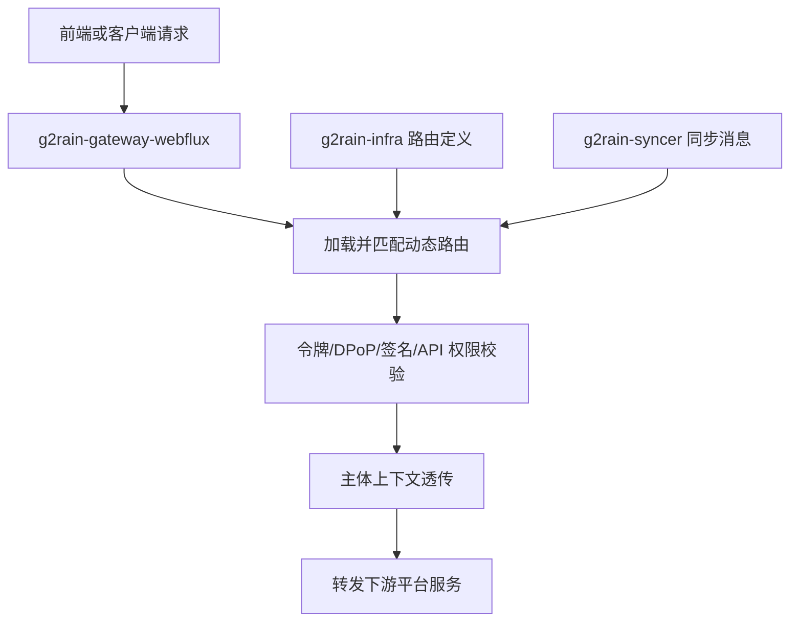



  

# g2rain-gateway-webmvc

下一代AI软件开发范式，AI原生Agent平台，开源的企业级SaaS底座。

统一网关入口服务，在过滤器链中执行令牌、DPoP 与签名校验；向下游透传主体上下文与身份信息；通过同步消息增量刷新路由与相关缓存

[官网](https://www.g2rain.com) · [Issues](https://github.com/g2rain/g2rain/issues) · [Discussions](https://github.com/g2rain/g2rain/discussions)

## 目录

- 项目简介
- 平台定位
- 业务域说明
- 功能概览
- 使用场景
- 核心流程
- 流程图
- 技术栈
- 环境要求
- 快速开始
- 配置说明
- 构建与镜像
- 代码质量与测试
- 接口示例
- 安全说明
- 与关联仓库的关系
- 模块说明
- 职责边界
- 常见问题
- 关联仓库
- 参与贡献
- 许可证
- 联系我们
- 致谢

## 项目简介

统一网关入口服务，在过滤器链中执行令牌、DPoP 与签名校验；向下游透传主体上下文与身份信息；通过同步消息增量刷新路由与相关缓存

## 平台定位

该仓库位于 g2rain 后端平台链路入口层，承担网关路由编排、请求校验与下游转发职责。 它与 g2rain-basis、g2rain-basis-api、g2rain-common、g2rain-infra 等服务协同完成路由加载、业务转发与平台集成。 它更偏向平台入口与流量治理，而不是承载具体业务域逻辑。

## 业务域说明

该仓库聚焦于 `网关路由与流量治理`。

核心对象包括：
- 登录令牌
- 访问令牌
- 路由
- 权限
- 应用
- 主体

主要流程包括：
- 路由增量同步与刷新流程
- 网关过滤器链鉴权与签名校验流程
- 主体透传与统一响应调整流程

## 功能概览

| 能力 | 说明 |
| --- | --- |
| 路由增量同步 | 订阅同步消息，对路由定义执行增量更新并刷新网关内存状态。 |
| 网关安全过滤 | 在入口过滤器链中执行令牌校验、DPoP 校验与请求签名校验。 |
| 主体上下文透传 | 将认证后的主体信息透传给下游服务，保持链路中的身份上下文一致。 |
| 网关文档聚合 | 基于当前路由视图聚合并暴露下游服务的 OpenAPI 文档入口。 |
| JWT 与密钥管理 | 基于 Nimbus JOSE JWT 处理令牌与密钥，支持从配置中心加载并切换签名密钥。 |
| 会话与缓存 | 结合 Redis 或同步组件维护路由、鉴权与入口侧缓存状态。 |
| 可观测性 | 暴露 Actuator 健康与信息端点，并引入追踪能力以便接入平台观测体系。 |

## 使用场景

| 场景 | 说明 |
| --- | --- |
| 统一网关入口 | 当平台需要统一承接前端请求、匹配路由并转发到下游服务时使用。 |
| 入口安全控制 | 当请求进入业务服务前需要统一执行令牌、DPoP、签名或 API 权限校验时使用。 |
| 动态路由治理 | 当网关路由需要从基础设施服务加载，并根据同步消息动态刷新时使用。 |

## 核心流程

| 流程 | 关键步骤 | 代码线索 |
| --- | --- | --- |
| 动态路由加载 | 服务启动后从基础设施服务读取路由定义 → 写入内存路由仓库 → 刷新网关运行时路由视图 | MemoryRouteLoader、InfraServiceClient、GatewayRouteLoader |
| 入口过滤器链 | 请求进入网关过滤器链 → 执行令牌、DPoP、签名或 API 权限校验 → 校验通过后透传主体上下文并转发下游服务 | GatewayTokenAuthFilter、GatewayDPoPAuthFilter、SignVerificationFilter、PrincipalForwardFilter |

## 流程图

## 技术栈

| 类别 | 说明 |
| --- | --- |
| 运行时 | Java 25、Spring Boot 4.0.5、Spring Cloud 2025.1.1 |
| 安全与令牌 | Nimbus JOSE JWT |
| 基础设施 | Redis、Nacos、OpenFeign、Spring Cloud LoadBalancer |
| 内部 API | g2rain-basis-api |
| 协同服务 | g2rain-infra |
| 其他 | SpringDoc OpenAPI、Micrometer Tracing、OpenTelemetry、Lombok |

## 环境要求

- JDK 25+
- Maven 3.9+
- Redis
- Nacos
- 可访问的 g2rain-infra 服务
- 可访问的 g2rain-basis 服务

## 快速开始

| 步骤 | 命令或位置 | 说明 |
| --- | --- | --- |
| 准备运行环境 | JDK 25+、Maven 3.9+、Redis、Nacos | 后端服务启动前需要准备 Java 构建环境和平台依赖的基础设施。 |
| 调整配置 | `src/main/resources/application.yml` | 按需设置 SERVER_PORT、SPRING_PROFILES_ACTIVE、NACOS_SERVER_ADDR 等环境变量。 网关还需要保证 g2rain-infra、g2rain-basis 等下游服务可访问。 |
| 构建项目 | `mvn clean package` | 执行 Maven 构建并生成可执行 Jar。 |
| 本地启动 | `mvn spring-boot:run` | 以当前 profile 启动服务，默认端口以 application.yml 中的 SERVER_PORT 为准。 |
| 验证服务 | `GET /actuator/health` | 服务启动后可通过健康检查确认运行状态。 |

版本号以项目构建配置为准，当前识别为 `1.0.0`。

## 配置说明

### 运行配置

| 配置项 | 说明 |
| --- | --- |
| `SERVER_PORT` | 默认 8083 |
| `SPRING_PROFILES_ACTIVE` | 默认 profile 为 dev |

### 平台集成配置

| 配置项 | 说明 |
| --- | --- |
| `NACOS_SERVER_ADDR` | 默认指向 127.0.0.1:8848，用于服务发现与配置中心连接 |
| `spring.cloud.stream.bindings.input.destination` | 订阅 g2rain-syncer 消息通道，用于网关路由等状态同步。 |

### 敏感配置

| 配置项 | 说明 |
| --- | --- |
| `spring.config.import` | 可选导入 g2rain-token-keypair.yml，用于加载令牌密钥等敏感配置 |

### 观测配置

| 配置项 | 说明 |
| --- | --- |
| `management.endpoints.web.exposure.include` | 默认暴露 health、info 等基础观测端点 |

### 消息配置

| 配置项 | 说明 |
| --- | --- |
| `SPRING_KAFKA_ENABLED` | 控制 Kafka 相关能力是否启用，默认关闭。 |

## 构建与镜像

| 目标 | 命令 | 产物 | 说明 |
| --- | --- | --- | --- |
| 可执行 Jar | `mvn clean package` | `g2rain-gateway-webmvc-1.0.0.jar` | 执行 Maven 标准构建，生成服务可执行产物。 |
| 本地运行 | `mvn spring-boot:run` | 本地 Spring Boot 进程 | 使用当前 profile 启动服务，便于本地联调。 |
| 容器镜像 | `mvn compile jib:dockerBuild` | 本地 Docker 镜像 | 通过 Jib 构建容器镜像，无需手写镜像构建流程。 |
| Dockerfile 镜像 | `docker build .` | 自定义 Docker 镜像 | 仓库提供 Dockerfile，可按组织镜像规范封装部署。 |

## 代码质量与测试

| 检查项 | 命令 | 说明 |
| --- | --- | --- |
| Maven Enforcer | `mvn validate` | 约束 JDK 版本、Maven 版本与依赖规则。 |
| Checkstyle | `mvn checkstyle:check` | 检查 Java 代码风格与组织规范。 |
| PMD | `mvn pmd:check` | 执行静态规则检查，识别潜在代码问题。 |
| SpotBugs | `mvn spotbugs:check` | 识别潜在缺陷和风险代码。 |
| JaCoCo | `mvn test jacoco:report` | 运行测试并生成覆盖率报告。 |

## 接口示例

| 示例 | 方法 | 路径 | 用途 | 调用示例 |
| --- | --- | --- | --- | --- |
| 查看聚合文档 | GET | `/swagger-ui-config` | 查看网关聚合后的 OpenAPI 文档配置。 | `curl http://localhost:8083/swagger-ui-config` |

## 安全说明

| 主题 | 说明 |
| --- | --- |
| 入口统一校验 | 网关承担入口令牌、DPoP、签名和权限过滤职责，下游服务不应假设未认证请求可信。 |
| 主体透传 | 主体上下文透传应只发生在可信链路内，生产环境需要配合网关、服务发现和网络边界控制。 |
| 密钥配置 | 令牌密钥和签名材料应通过配置中心或安全配置系统维护，不应写入公开仓库。 |

## 与关联仓库的关系

本仓库作为平台统一入口网关，与 g2rain-infra、g2rain-basis 协同完成路由加载、业务转发、主体透传与缓存刷新。

## 模块说明

| 模块 | 职责说明 | 代码线索 |
| --- | --- | --- |
| 入口安全过滤 | 在请求进入下游服务前执行令牌、DPoP、签名与 API 权限校验。 | GatewayTokenAuthFilter、GatewayDPoPAuthFilter、SignVerificationFilter、ApiPermissionFilter |
| 主体上下文透传 | 将认证后的主体上下文、身份信息与链路信息透传给下游服务。 | PrincipalForwardFilter、EdgePrincipalContextScopeFilter |
| 网关文档聚合 | 基于网关路由视图聚合并暴露平台服务的 OpenAPI 文档入口。 | OpenApiController |

## 职责边界

该仓库主要负责：
- 负责网关入口层的路由匹配、过滤器编排与下游转发
- 负责网关层认证、签名校验与主体上下文透传
- 负责路由定义加载、缓存刷新与入口观测能力

该仓库默认不负责：
- 不负责具体业务域的核心业务实现
- 不直接作为业务主数据的权威来源
- 不替代下游服务完成业务处理与持久化职责

## 常见问题

| 问题 | 可能原因 | 处理建议 |
| --- | --- | --- |
| 路由未生效 | g2rain-infra 不可访问或同步消息未到达。 | 检查基础设施服务、路由配置和 g2rain-syncer 消息通道。 |
| 请求被网关拒绝 | 令牌、DPoP、签名或 API 权限校验不通过。 | 检查请求头、签名材料、令牌有效性和应用权限配置。 |
| Swagger 文档不可见 | 下游服务路由或 OpenAPI 聚合配置不完整。 | 确认路由已加载，并检查下游服务文档端点。 |

## 关联仓库

| 仓库 | 协作关系 |
| --- | --- |
| g2rain-basis | 协同提供用户、应用、通行证等平台基础主数据能力。 |
| g2rain-basis-api | 通过内部 API 访问平台基础主数据与基础服务能力。 |
| g2rain-common | 复用平台公共规范、通用模型、工具能力或基础依赖约束。 |
| g2rain-infra | 协同提供路由、配置、基础设施数据或平台运行支撑能力。 |

## 参与贡献

我们欢迎所有形式的贡献：Issue 反馈、文档改进、功能建议与代码提交。

推荐流程：

1. Fork 本仓库。
2. 创建特性分支：`git checkout -b feature/your-feature-name`。
3. 提交更改：`git commit -m "Add some feature"`。
4. 推送分支：`git push origin feature/your-feature-name`。
5. 提交 Pull Request。

代码贡献前请尽量补充必要的测试和文档，并确保构建、测试与静态检查通过。

## 许可证

本项目基于 [Apache 2.0许可证](https://github.com/g2rain/g2rain-common/blob/main/LICENSE) 开源。

## 联系我们

- Issues: [GitHub Issues](https://github.com/g2rain/g2rain/issues)
- 讨论: [GitHub Discussions](https://github.com/g2rain/g2rain/discussions)
- 邮箱: g2rain_developer@163.com

## 致谢

感谢所有为 g2rain 项目提交 Issue、代码、文档、建议和使用反馈的开发者们！
