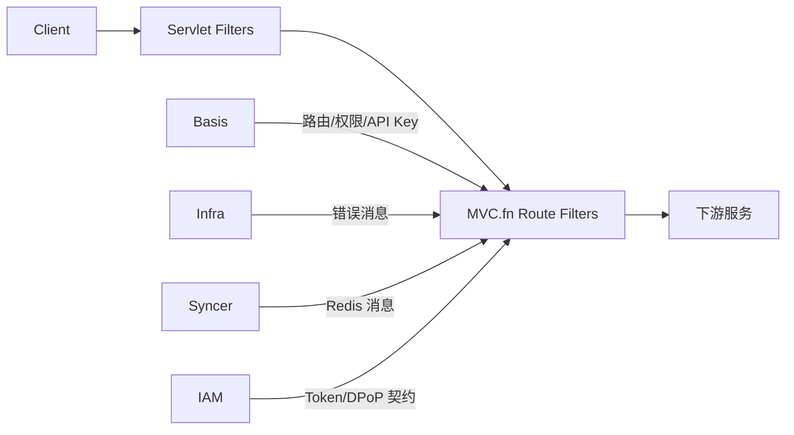

# 架构总览

本项目使用 Spring Cloud Gateway Server WebMVC 与 MVC.fn。`GatewayRouteLoader` 通过 Basis API Feign 客户端加载路由和服务注册，编译为 `RouterFunction`，由 `RouterFuncHolder` 维护匹配表与运行时快照。

虚拟线程承载阻塞调用，但不取消线程、连接、超时和请求体大小治理责任。Gateway 只执行入口策略，下游继续执行业务和数据级授权。
